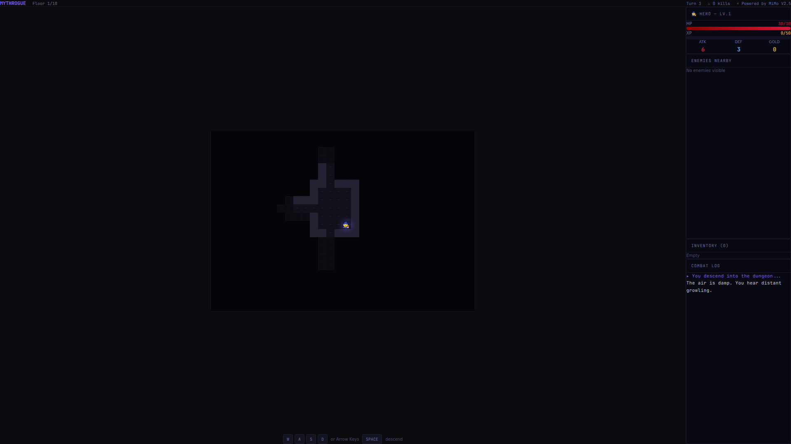
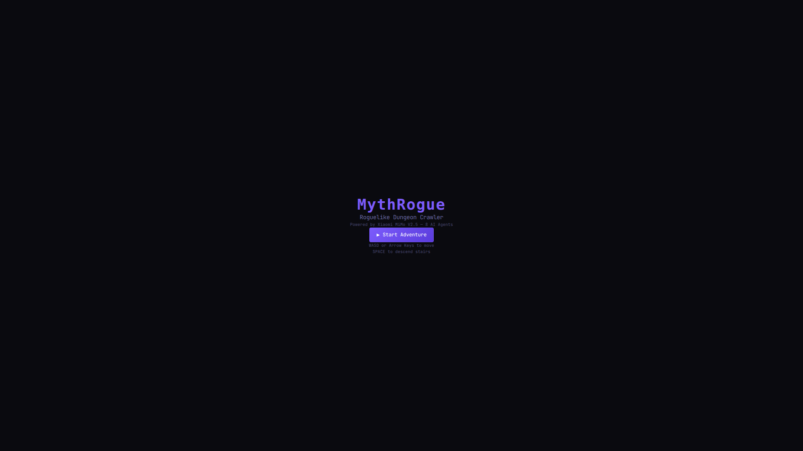
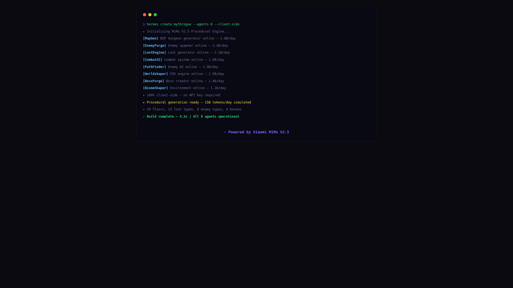

# MythRogue

> **Powered by Xiaomi MiMo V2.5** — Roguelike Dungeon Crawler

Fully client-side roguelike dungeon crawler with procedural generation. No API key needed — everything runs in your browser.



## Features

- **10 Floors** of increasing difficulty
- **Procedural Dungeons** — every run is unique
- **Turn-Based Combat** with critical hits and loot drops
- **Permadeath** — die and start over
- **Multiple Biomes** — caves, ruins, crypts, and more
- **Boss Fights** — challenging end-of-floor encounters
- **Item System** — weapons, armor, potions, and artifacts

## Tech Stack

- **Framework:** Next.js 16 (App Router)
- **Language:** TypeScript
- **Styling:** Tailwind CSS
- **State:** Zustand
- **Rendering:** Canvas API

## Game Systems

| System | Description |
|--------|-------------|
| Map Generator | Procedural dungeon layouts |
| World Builder | Biome and environment generation |
| Enemy Forge | Enemy creation with scaling difficulty |
| Boss Forge | Boss encounter generation |
| Loot Engine | Random item and reward generation |
| Combat AI | Enemy behavior and attack patterns |

## Screenshots






## Getting Started

```bash
git clone https://github.com/ferah1223/mythrogue.git
cd mythrogue
npm install
npm run dev
```

Open [http://localhost:3000](http://localhost:3000) to start your run.

## How to Play

1. Click **New Run** to start a fresh dungeon
2. Use **WASD** or **Arrow Keys** to move
3. Bump into enemies to attack
4. Collect loot and descend to the next floor
5. Survive 10 floors to win
6. Die and try again — every run is different

---

**Powered by Xiaomi MiMo V2.5**
